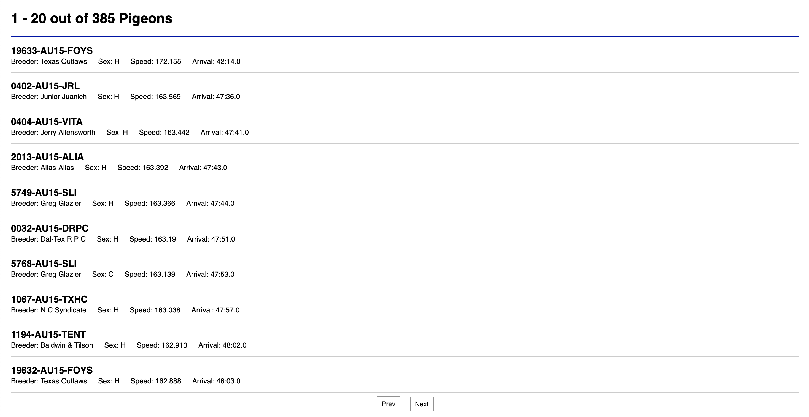
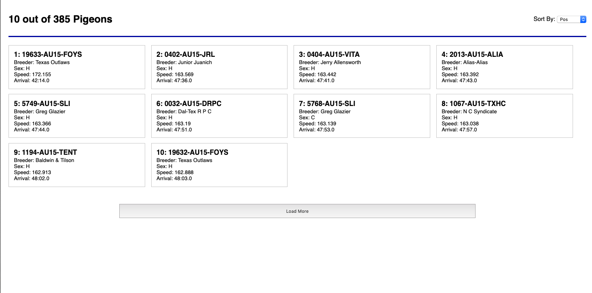
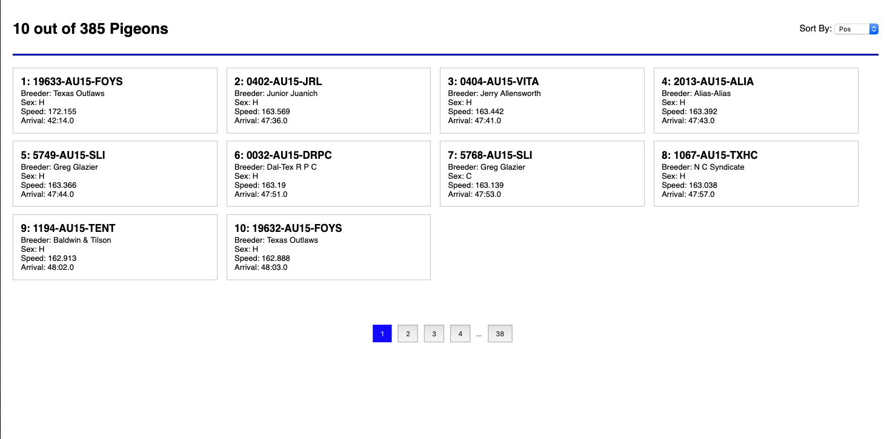

# Gigamon ThreatINSIGHT Interview Project

Welcome. Thank you for interviewing with the Gigamon Insight UI/UX Team.

This project is a take home programming exercise that lets us get an idea of your level of skill and exposure to the technologies we work with and get a general idea of how you approach problems and tasks.

Below you'll find instructions on how to get started and the specific tasks we'd like to work through in this process. Feel free to use your favorite coding IDE and any external resources that would be helpful.

For these exercises, we would like you to create a front end application. You
are free to use any front end framework and tooling that you are comfortable
using. (We use React)

In this exercise, three different views will be produced to display the results
of pigeon racing data. Please produce all different UIs along with a method for
switching among them. 

Please submit the code along with build instructions. (You may give use a link
to a github repo or another source.)


## Initial Setup

Starting the backend:

1. Ensure you have the required runtime environment
    - Node v10+
    - Access to the Internet
2. Install the dependencies `npm install` or `yarn install`
3. Run the project `npm start` or `yarn start`

This will run the backend service on port 3002

## Task 1

For this first task, we'd like you to use the [RESTful API](#api-reference) we've documented later in this document to create the UI show in this image



This UI shows a paginated list of the world pigeon racing championship results from 2015.

You'll see that each entry lists the following information:

- The pigeon's name
- Who bred the pigeon
- The pigeon's gender
- The average speed
- The arrival time

The pagination should show a previous and next button to load the designated number of pigeons before or after the currently visible set.

## Task 2

For this task, we'd like you to extend your previous code to show the following design



You'll see that in this design, the vertical list is now a collection of cards. We would like this collection to be sortable by any of the fields visible by choosing from a dropdown above the collection.

We'd also like to change the pagination to an "add more" button that retrieves more records and adds them to the collection. The grid should be responsive and when resized the cards should all remain evenly sized and spaced with every row aligned to the left edge.  Each card can grow as space allows but the cards should never get small enough to make any content wrap inside the card.



The pagination needs to be updated again and should now show the first and last pages at all times and then 3 pages centered around the current page. When the current page is the first page, show two pages after that instead. When the current page is the last page, show two pages prior to that instead.

## API Reference

By default this api is located at `http://localhost:3002`.  It uses these data structures.

## Pigeon Object

```yaml
{
    "Pos": Int, // The position the pigeon finished the race in.
    "Breeder": String, // The name of the breeder.
    "Pigeon": String, // The name of the pigeon.
    "Color": String, // The color of the pigeon.
    "Sex": String, // The gender of the pigeon.
    "Arrival": String, // The time of arrival at the finish line.
    "Speed": Float, // The average speed of the pigeon.
}
```

## `GET /pigeons`

This endpoint returns an array of **Pigeon** objects.

It accepts the following query parameters

- _start: Int - defines the start index to return, optional.
- _end: Int - defines the end index to return, optional.
- _page: Int - defines the page number to return, optional.
- _limit: Int - defines the number of records to return, optional.
- _sort: String - defines the field to sort the results by, optional.
- _order: asc|desc - defines the directions to sort the results, optional.

Example request
`http://localhost:3002/pigeons?_page=7&_limit=20`

### Note

When using _limit, the service will respond with a header named X-Total-Count that contains the total number of records that are in the collection.
